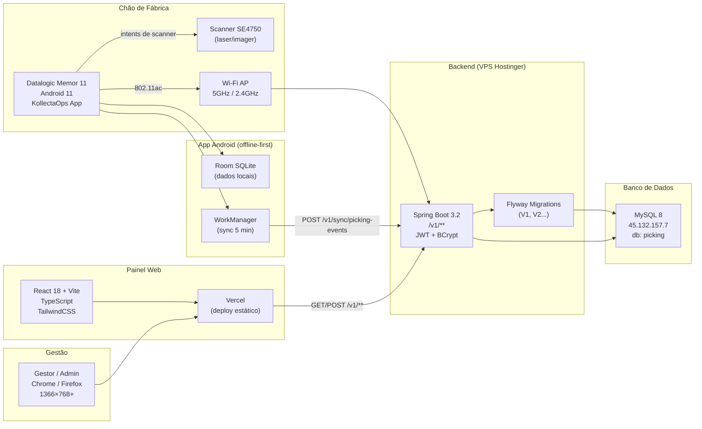
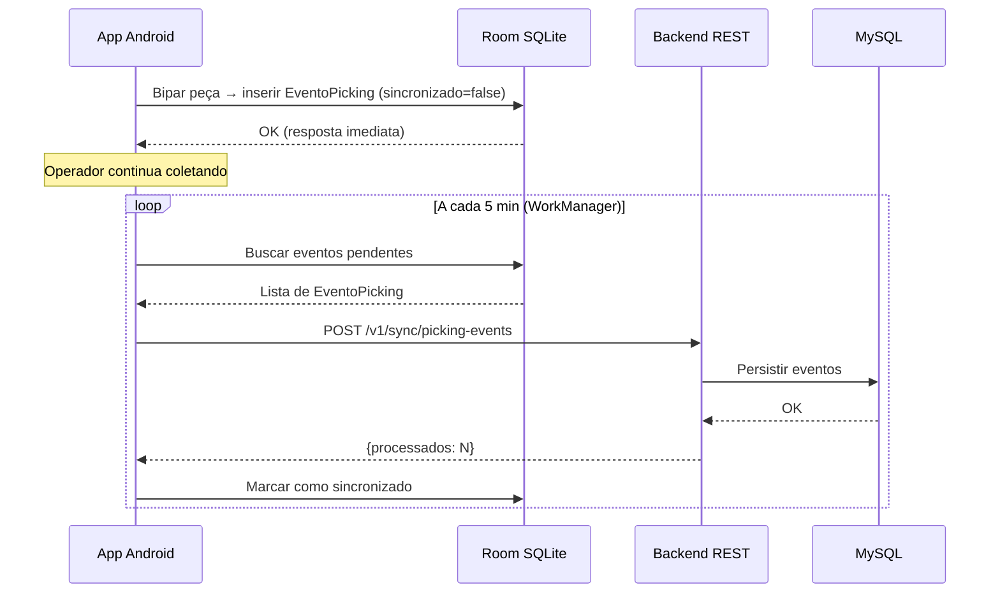

# Diagrama de Arquitetura — KollectaOps

```mermaid
graph LR
    subgraph "Chão de Fábrica"
        MEM11["Datalogic Memor 11\nAndroid 11\nKollectaOps App"]
        SCANNER["Scanner SE4750\n(laser/imager)"]
        WIFI["Wi-Fi AP\n5GHz / 2.4GHz"]
        MEM11 -- "intents de scanner" --> SCANNER
        MEM11 -- "802.11ac" --> WIFI
    end

    subgraph "App Android (offline-first)"
        ROOM["Room SQLite\n(dados locais)"]
        WORK["WorkManager\n(sync 5 min)"]
        MEM11 --> ROOM
        MEM11 --> WORK
    end

    subgraph "Backend (VPS Hostinger)"
        API["Spring Boot 3.2\n/v1/**\nJWT + BCrypt"]
        FLYWAY["Flyway Migrations\n(V1, V2...)"]
        API --> FLYWAY
    end

    subgraph "Banco de Dados"
        MYSQL["MySQL 8\n45.132.157.7\ndb: picking"]
        FLYWAY --> MYSQL
        API --> MYSQL
    end

    subgraph "Painel Web"
        REACT["React 18 + Vite\nTypeScript\nTailwindCSS"]
        VERCEL["Vercel\n(deploy estático)"]
        REACT --> VERCEL
    end

    subgraph "Gestão"
        ADMIN["Gestor / Admin\nChrome / Firefox\n1366×768+"]
        ADMIN --> VERCEL
    end

    WIFI --> API
    WORK -- "POST /v1/sync/picking-events" --> API
    VERCEL -- "GET/POST /v1/**" --> API
```

## Fluxo de dados offline-first

```mermaid
sequenceDiagram
    participant APP as App Android
    participant ROOM as Room SQLite
    participant API as Backend REST
    participant DB as MySQL

    APP->>ROOM: Bipar peça → inserir EventoPicking (sincronizado=false)
    ROOM-->>APP: OK (resposta imediata)
    Note over APP: Operador continua coletando

    loop A cada 5 min (WorkManager)
        APP->>ROOM: Buscar eventos pendentes
        ROOM-->>APP: Lista de EventoPicking
        APP->>API: POST /v1/sync/picking-events
        API->>DB: Persistir eventos
        DB-->>API: OK
        API-->>APP: {processados: N}
        APP->>ROOM: Marcar como sincronizado
    end
```
