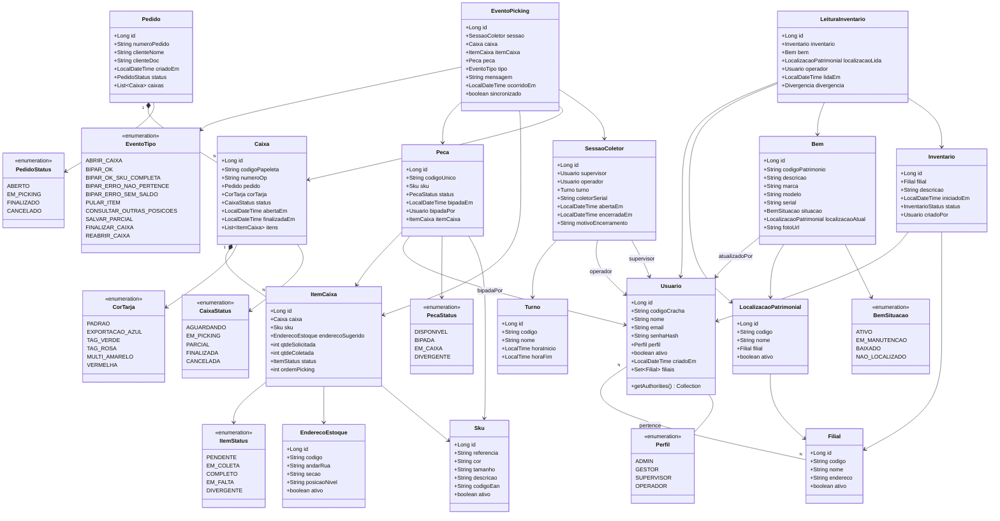

# Diagrama de Classes — KollectaOps (Domínio)

```mermaid
classDiagram
    class Usuario {
        +Long id
        +String codigoCracha
        +String nome
        +String email
        +String senhaHash
        +Perfil perfil
        +boolean ativo
        +LocalDateTime criadoEm
        +Set~Filial~ filiais
        +getAuthorities() Collection
    }

    class Perfil {
        <<enumeration>>
        ADMIN
        GESTOR
        SUPERVISOR
        OPERADOR
    }

    class Filial {
        +Long id
        +String codigo
        +String nome
        +String endereco
        +boolean ativo
    }

    class Turno {
        +Long id
        +String codigo
        +String nome
        +LocalTime horaInicio
        +LocalTime horaFim
    }

    class SessaoColetor {
        +Long id
        +Usuario supervisor
        +Usuario operador
        +Turno turno
        +String coletorSerial
        +LocalDateTime abertaEm
        +LocalDateTime encerradaEm
        +String motivoEncerramento
    }

    class Pedido {
        +Long id
        +String numeroPedido
        +String clienteNome
        +String clienteDoc
        +LocalDateTime criadoEm
        +PedidoStatus status
        +List~Caixa~ caixas
    }

    class PedidoStatus {
        <<enumeration>>
        ABERTO
        EM_PICKING
        FINALIZADO
        CANCELADO
    }

    class Caixa {
        +Long id
        +String codigoPapeleta
        +String numeroOp
        +Pedido pedido
        +CorTarja corTarja
        +CaixaStatus status
        +LocalDateTime abertaEm
        +LocalDateTime finalizadaEm
        +List~ItemCaixa~ itens
    }

    class CaixaStatus {
        <<enumeration>>
        AGUARDANDO
        EM_PICKING
        PARCIAL
        FINALIZADA
        CANCELADA
    }

    class CorTarja {
        <<enumeration>>
        PADRAO
        EXPORTACAO_AZUL
        TAG_VERDE
        TAG_ROSA
        MULTI_AMARELO
        VERMELHA
    }

    class Sku {
        +Long id
        +String referencia
        +String cor
        +String tamanho
        +String descricao
        +String codigoEan
        +boolean ativo
    }

    class EnderecoEstoque {
        +Long id
        +String codigo
        +String andarRua
        +String secao
        +String posicaoNivel
        +boolean ativo
    }

    class ItemCaixa {
        +Long id
        +Caixa caixa
        +Sku sku
        +EnderecoEstoque enderecoSugerido
        +int qtdeSolicitada
        +int qtdeColetada
        +ItemStatus status
        +int ordemPicking
    }

    class ItemStatus {
        <<enumeration>>
        PENDENTE
        EM_COLETA
        COMPLETO
        EM_FALTA
        DIVERGENTE
    }

    class Peca {
        +Long id
        +String codigoUnico
        +Sku sku
        +PecaStatus status
        +LocalDateTime bipadaEm
        +Usuario bipadaPor
        +ItemCaixa itemCaixa
    }

    class PecaStatus {
        <<enumeration>>
        DISPONIVEL
        BIPADA
        EM_CAIXA
        DIVERGENTE
    }

    class EventoPicking {
        +Long id
        +SessaoColetor sessao
        +Caixa caixa
        +ItemCaixa itemCaixa
        +Peca peca
        +EventoTipo tipo
        +String mensagem
        +LocalDateTime ocorridoEm
        +boolean sincronizado
    }

    class EventoTipo {
        <<enumeration>>
        ABRIR_CAIXA
        BIPAR_OK
        BIPAR_OK_SKU_COMPLETA
        BIPAR_ERRO_NAO_PERTENCE
        BIPAR_ERRO_SEM_SALDO
        PULAR_ITEM
        CONSULTAR_OUTRAS_POSICOES
        SALVAR_PARCIAL
        FINALIZAR_CAIXA
        REABRIR_CAIXA
    }

    class Bem {
        +Long id
        +String codigoPatrimonio
        +String descricao
        +String marca
        +String modelo
        +String serial
        +BemSituacao situacao
        +LocalizacaoPatrimonial localizacaoAtual
        +String fotoUrl
    }

    class BemSituacao {
        <<enumeration>>
        ATIVO
        EM_MANUTENCAO
        BAIXADO
        NAO_LOCALIZADO
    }

    class LocalizacaoPatrimonial {
        +Long id
        +String codigo
        +String nome
        +Filial filial
        +boolean ativo
    }

    class Inventario {
        +Long id
        +Filial filial
        +String descricao
        +LocalDateTime iniciadoEm
        +InventarioStatus status
        +Usuario criadoPor
    }

    class LeituraInventario {
        +Long id
        +Inventario inventario
        +Bem bem
        +LocalizacaoPatrimonial localizacaoLida
        +Usuario operador
        +LocalDateTime lidaEm
        +Divergencia divergencia
    }

    Usuario -- Perfil
    Usuario "N" -- "N" Filial : pertence
    SessaoColetor --> Usuario : supervisor
    SessaoColetor --> Usuario : operador
    SessaoColetor --> Turno
    Pedido --> PedidoStatus
    Pedido "1" *-- "N" Caixa
    Caixa --> CaixaStatus
    Caixa --> CorTarja
    Caixa "1" *-- "N" ItemCaixa
    ItemCaixa --> Sku
    ItemCaixa --> EnderecoEstoque
    ItemCaixa --> ItemStatus
    Peca --> Sku
    Peca --> PecaStatus
    Peca --> Usuario : bipadaPor
    Peca --> ItemCaixa
    EventoPicking --> SessaoColetor
    EventoPicking --> Caixa
    EventoPicking --> ItemCaixa
    EventoPicking --> Peca
    EventoPicking --> EventoTipo
    Bem --> BemSituacao
    Bem --> LocalizacaoPatrimonial
    Bem --> Usuario : atualizadoPor
    LocalizacaoPatrimonial --> Filial
    Inventario --> Filial
    Inventario --> Usuario
    LeituraInventario --> Inventario
    LeituraInventario --> Bem
    LeituraInventario --> LocalizacaoPatrimonial
    LeituraInventario --> Usuario
```
