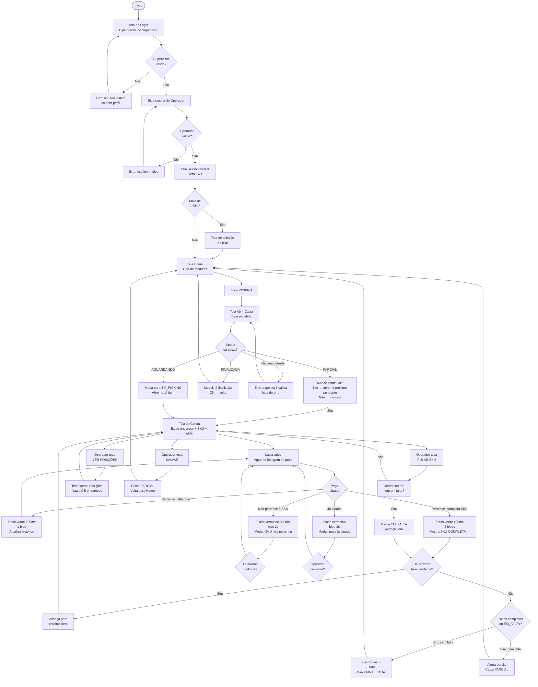

# Fluxo de Picking — KollectaOps

```mermaid
flowchart TD
    A([Início]) --> B[Tela de Login\nBipe crachá do Supervisor]
    B --> C{Supervisor\nválido?}
    C -- Não --> ERR1[Erro: usuário inativo\nou sem perfil] --> B
    C -- Sim --> D[Bipe crachá do Operador]
    D --> E{Operador\nválido?}
    E -- Não --> ERR2[Erro: usuário inativo] --> D
    E -- Sim --> F[Cria SessaoColetor\nGera JWT]
    F --> G{Mais de\n1 filial?}
    G -- Sim --> H[Tela de seleção\nde filial] --> I
    G -- Não --> I[Tela Home\nGrid de módulos]
    I --> J[Toca PICKING]
    J --> K[Tela Abrir Caixa\nBipe papeleta]
    K --> L{Status\nda caixa?}
    L -- AGUARDANDO --> M[Muda para EM_PICKING\nAbre no 1º item]
    L -- PARCIAL --> N[Modal: continuar?\nSim → abre no próximo pendente\nNão → cancela]
    L -- FINALIZADA --> O[Modal: já finalizada\nOK → volta] --> I
    L -- Não encontrada --> P[Erro: papeleta inválida\nbipe de erro] --> K
    N -- Sim --> Q
    M --> Q[Tela de Coleta\nExibe endereço + SKU + qtde]
    Q --> R[Laser ativo\nAguarda bipagem de peça]
    R --> S{Peça\nbipada}
    S -- Pertence, falta qtde --> T[Flash verde 200ms\n1 bipe\nAtualiza histórico]
    T --> R
    S -- Pertence, completa SKU --> U[Flash verde 400ms\n2 bipes\nMostra SKU COMPLETA →]
    U --> V{Há próximo\nitem pendente?}
    V -- Sim --> W[Avança para\npróximo item] --> Q
    V -- Não --> X{Todos completos\nou EM_FALTA?}
    X -- Sim, sem falta --> Y[Flash branco\n3 tons\nCaixa FINALIZADA]
    X -- Sim, com falta --> Z[Alerta parcial\nCaixa PARCIAL]
    Y --> I
    Z --> I
    S -- Não pertence à SKU --> ERR3[Flash vermelho 300ms\nbipe 2s\nModal: SKU não pertence]
    ERR3 --> AA{Operador\nconfirma?} --> R
    S -- Já bipada --> ERR4[Flash vermelho\nbipe 2s\nModal: peça já bipada]
    ERR4 --> BB{Operador\nconfirma?} --> R
    Q --> CC[Operador toca\nPULAR SKU]
    CC --> DD[Modal: retirar\nitem em falta?]
    DD -- Sim --> EE[Marca EM_FALTA\nAvança item] --> V
    DD -- Não --> Q
    Q --> FF[Operador toca\nVER POSIÇÕES]
    FF --> GG[Tela Outras Posições\nlista até 5 endereços] --> Q
    Q --> HH[Operador toca\nSALVAR]
    HH --> II[Caixa PARCIAL\nVolta para Home] --> I
```
