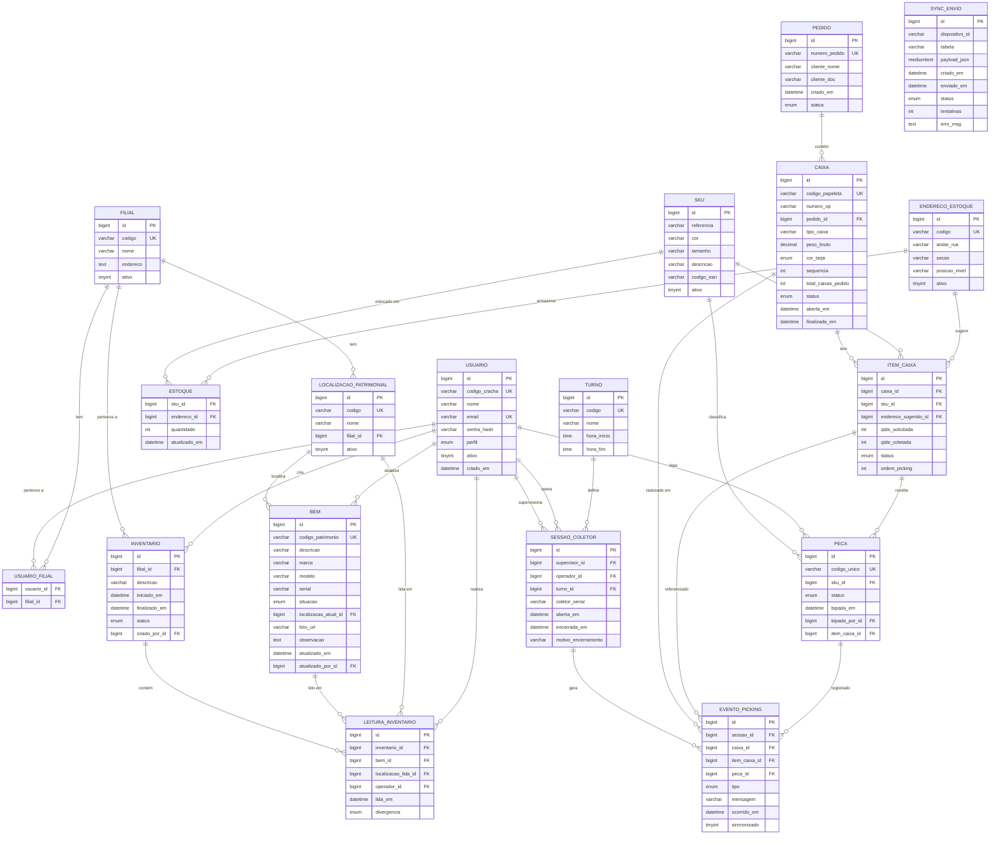

# Diagrama Entidade-Relacionamento — KollectaOps

```mermaid
erDiagram
    USUARIO {
        bigint id PK
        varchar codigo_cracha UK
        varchar nome
        varchar email UK
        varchar senha_hash
        enum perfil
        tinyint ativo
        datetime criado_em
    }
    FILIAL {
        bigint id PK
        varchar codigo UK
        varchar nome
        text endereco
        tinyint ativo
    }
    USUARIO_FILIAL {
        bigint usuario_id FK
        bigint filial_id FK
    }
    TURNO {
        bigint id PK
        varchar codigo UK
        varchar nome
        time hora_inicio
        time hora_fim
    }
    SESSAO_COLETOR {
        bigint id PK
        bigint supervisor_id FK
        bigint operador_id FK
        bigint turno_id FK
        varchar coletor_serial
        datetime aberta_em
        datetime encerrada_em
        varchar motivo_encerramento
    }
    PEDIDO {
        bigint id PK
        varchar numero_pedido UK
        varchar cliente_nome
        varchar cliente_doc
        datetime criado_em
        enum status
    }
    CAIXA {
        bigint id PK
        varchar codigo_papeleta UK
        varchar numero_op
        bigint pedido_id FK
        varchar tipo_caixa
        decimal peso_bruto
        enum cor_tarja
        int sequencia
        int total_caixas_pedido
        enum status
        datetime aberta_em
        datetime finalizada_em
    }
    SKU {
        bigint id PK
        varchar referencia
        varchar cor
        varchar tamanho
        varchar descricao
        varchar codigo_ean
        tinyint ativo
    }
    ENDERECO_ESTOQUE {
        bigint id PK
        varchar codigo UK
        varchar andar_rua
        varchar secao
        varchar posicao_nivel
        tinyint ativo
    }
    ESTOQUE {
        bigint sku_id FK
        bigint endereco_id FK
        int quantidade
        datetime atualizado_em
    }
    ITEM_CAIXA {
        bigint id PK
        bigint caixa_id FK
        bigint sku_id FK
        bigint endereco_sugerido_id FK
        int qtde_solicitada
        int qtde_coletada
        enum status
        int ordem_picking
    }
    PECA {
        bigint id PK
        varchar codigo_unico UK
        bigint sku_id FK
        enum status
        datetime bipada_em
        bigint bipada_por_id FK
        bigint item_caixa_id FK
    }
    EVENTO_PICKING {
        bigint id PK
        bigint sessao_id FK
        bigint caixa_id FK
        bigint item_caixa_id FK
        bigint peca_id FK
        enum tipo
        varchar mensagem
        datetime ocorrido_em
        tinyint sincronizado
    }
    LOCALIZACAO_PATRIMONIAL {
        bigint id PK
        varchar codigo UK
        varchar nome
        bigint filial_id FK
        tinyint ativo
    }
    BEM {
        bigint id PK
        varchar codigo_patrimonio UK
        varchar descricao
        varchar marca
        varchar modelo
        varchar serial
        enum situacao
        bigint localizacao_atual_id FK
        varchar foto_url
        text observacao
        datetime atualizado_em
        bigint atualizado_por_id FK
    }
    INVENTARIO {
        bigint id PK
        bigint filial_id FK
        varchar descricao
        datetime iniciado_em
        datetime finalizado_em
        enum status
        bigint criado_por_id FK
    }
    LEITURA_INVENTARIO {
        bigint id PK
        bigint inventario_id FK
        bigint bem_id FK
        bigint localizacao_lida_id FK
        bigint operador_id FK
        datetime lida_em
        enum divergencia
    }
    SYNC_ENVIO {
        bigint id PK
        varchar dispositivo_id
        varchar tabela
        mediumtext payload_json
        datetime criado_em
        datetime enviado_em
        enum status
        int tentativas
        text erro_msg
    }

    USUARIO ||--o{ USUARIO_FILIAL : "pertence a"
    FILIAL ||--o{ USUARIO_FILIAL : "tem"
    USUARIO ||--o{ SESSAO_COLETOR : "supervisiona"
    USUARIO ||--o{ SESSAO_COLETOR : "opera"
    TURNO ||--o{ SESSAO_COLETOR : "define"
    PEDIDO ||--o{ CAIXA : "contém"
    CAIXA ||--o{ ITEM_CAIXA : "tem"
    SKU ||--o{ ITEM_CAIXA : "referenciado por"
    ENDERECO_ESTOQUE ||--o{ ITEM_CAIXA : "sugere"
    SKU ||--o{ ESTOQUE : "estocado em"
    ENDERECO_ESTOQUE ||--o{ ESTOQUE : "armazena"
    SKU ||--o{ PECA : "classifica"
    USUARIO ||--o{ PECA : "bipa"
    ITEM_CAIXA ||--o{ PECA : "recebe"
    SESSAO_COLETOR ||--o{ EVENTO_PICKING : "gera"
    CAIXA ||--o{ EVENTO_PICKING : "rastreado em"
    ITEM_CAIXA ||--o{ EVENTO_PICKING : "referenciado"
    PECA ||--o{ EVENTO_PICKING : "registrado"
    FILIAL ||--o{ LOCALIZACAO_PATRIMONIAL : "tem"
    LOCALIZACAO_PATRIMONIAL ||--o{ BEM : "localiza"
    USUARIO ||--o{ BEM : "atualiza"
    FILIAL ||--o{ INVENTARIO : "pertence a"
    USUARIO ||--o{ INVENTARIO : "cria"
    INVENTARIO ||--o{ LEITURA_INVENTARIO : "contém"
    BEM ||--o{ LEITURA_INVENTARIO : "lido em"
    LOCALIZACAO_PATRIMONIAL ||--o{ LEITURA_INVENTARIO : "lida em"
    USUARIO ||--o{ LEITURA_INVENTARIO : "realiza"
```
